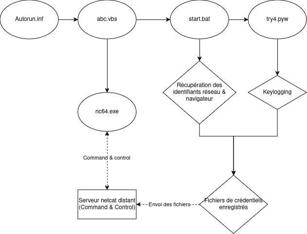

# Partie 2.2 README

Il y a deux versions, une en go, dans le sous-dossier "source", une avec divers méchanismes décrits ci-dessous. Les exes ne sont pas inclus.

## Fonctionnement du keylogger

Dans le fichier `bad_usb` se trouve un keylogger qui enregistre les frappes de clavier et les envoie à un serveur distant. Le keylogger est écrit en Python et utilise la bibliothèque `pynput` pour enregistrer les frappes de clavier. Le keylogger est exécuté en arrière-plan et enregistre les frappes de clavier dans un fichier texte. 

Cela dit, pour que le keylogger soit exécuté en arrière-plan, nous avons du créer un vecteur d'attaque. Sur Windows, voici un diagramme de comment le keylogger est exécuté en arrière-plan :

En résumé, lorsque l'utilisateur insère la clé usb dans son ordinateur, le fichier `autorun.inf` est exécuté. Ce fichier lance un VBS qui lance netcat pour ouvrir une connexion avec le serveur distant. Il lance également `start.bat`. Ce ficher fait plusieurs choses : il récupère le fichier de crédentiels de Chrome, récupère les identifiants réseau de la machine, et lance le keylogger.

Ensuite, il suffit de récupérer les fichiers en question via le serveur Netcat.

### Pour d'autres systèmes d'exploitation et navigateurs

Pour d'autres systèmes d'exploitation, tels que MacOS ou Linux, nous pourrions imaginer un payload avec un fichier PDF corrompu, tel que présenté dans la partie 2.1. le reste du code pourrait suivre un modus operandi similaire, bien qu'il faudrait simplement adapter les scripts bat en scripts bash ou autre. Idem pour des navigateurs autres que Chrome, il suffit de changer les chemins d'accès aux fichiers de crédentiels différer d'un système d'explotation, et d'un navigateur à l'autre.

Nous pensons que le proof of concept sur Windows est suffisant pour illustrer le fonctionnement du keylogger et comment il pourrait être adapté à d'autres systèmes d'exploitation.

## Disclaimer 

Certaines parties de ce code sont inspirées, et reprises en partie des sources envoyées sur Discord, notamment [ici](https://rajmehta2012.medium.com/introduction-274b4f4f6724).
